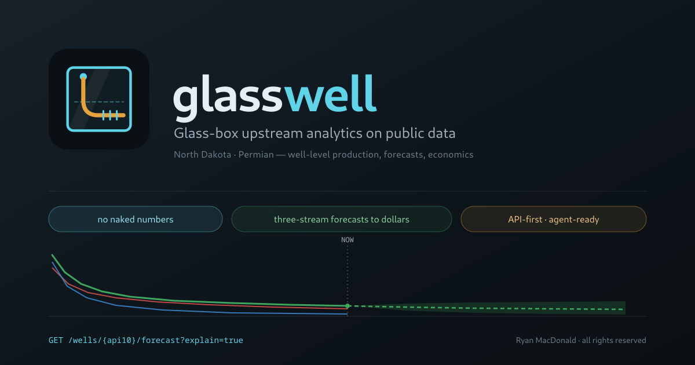

<p align="center">
  <picture>
    <source media="(prefers-color-scheme: dark)" srcset="assets/banner-dark.svg">
    <source media="(prefers-color-scheme: light)" srcset="assets/banner-light.svg">
    
  </picture>
</p>

<p align="center"><strong>Glass-box upstream analytics on public data</strong></p>

<p align="center">
  
  
  <a href="https://www.gnu.org/licenses/old-licenses/gpl-2.0.html"></a>
  
  
</p>

glasswell rebuilds the public-data tier of the upstream analytics stack — well-level
production, three-stream forecasts, economics, scenarios, inventory, and a map —
across two structurally different reporting regimes, and exposes every decision
inside it. Ingest, cleaning, cross-source conformance, modelling, and valuation are
queryable surfaces rather than internals. Every figure it serves carries a
derivation handle back to a checksummed regulator file, or it does not ship.

<p align="center">
  Well-level production &#183; three-stream forecasts &#183; DCF economics &#183;
  scenarios &amp; sensitivities &#183; analogs &#183; inventory &#183; vector-tile map &#183;
  complete self-describing API
</p>

> Copyright (C) 2026 [R-fx Networks](https://www.rfxn.com) &lt;proj@rfxn.com&gt; &#183; Ryan MacDonald &#183; Licensed under [GNU GPL v2](https://www.gnu.org/licenses/old-licenses/gpl-2.0.html)

> [!IMPORTANT]
> **Pre-build, private, and not a product.** This repository currently holds the
> blueprint and the collateral built from it — no application code has been
> written yet. glasswell is a personal single-operator build on public regulator
> data. It is not commercial, not multi-tenant, not investment advice, and not a
> source of verified reserves or ownership. Public release is gated on the IP
> review in [`blueprint.md`](blueprint.md) §8.2.

<p align="center"></p>

---

## Contents

- [Why it exists](#why-it-exists)
- [The glass box](#the-glass-box)
- [Architecture](#architecture)
- [The canonical model is the product](#the-canonical-model-is-the-product)
- [Forecast to dollars](#forecast-to-dollars)
- [Data sources](#data-sources)
- [API surface](#api-surface)
- [Build phases](#build-phases)
- [Success criteria](#success-criteria)
- [What this is not](#what-this-is-not)
- [Project docs](#project-docs)
- [License](#license)
- [Support](#support)

---

## Why it exists

Upstream capital decisions — drill, buy, lend, trade — all reduce to one question:
given the rock, the completion design, and depletion by the neighbours, what will
this well produce and what is that worth. The incumbent workflow is a manual type
curve in a spreadsheet. The vendor answer is curated data plus machine-learning
forecasts plus economics plus dashboards, delivered from a black box.

glasswell rebuilds that loop on public files, alone, and opens the box. It exists to
answer questions that are hard to answer from either side of a sales call:

1. Where does public data actually fail, and what exactly does proprietary data buy?
2. How large is the machine-learning advantage over a type curve when it is measured honestly?
3. What does the forecast-to-dollars path look like, and who consumes which output?
4. Where does an agent layer fit, and what does it demand from the API?
5. What is the measured error rate of public data, and what does allocation cost in accuracy?
6. Does a model trained in one basin transfer to another, and what breaks when it moves?
7. What does audit-grade lineage cost to build, and is it viable as a product feature?
8. How much of this category's product surface is schema and conformance work rather than modelling?

Two mandates, one system. It has to work — a real loop over real files, with the
numbers checked. And it has to teach — if a visitor cannot trace a figure on screen
back to a checksummed regulator file, the build has failed even when the number is
right.

## The glass box

A garage build cannot compete on brand or data volume, so its only trust mechanism
is total transparency. That turns out to be the interesting part: audit-grade
provenance is a feature this category should ship and does not.

<p align="center"></p>

Six rules, and they are load-bearing rather than aspirational:

1. **No naked numbers.** Every served figure carries a derivation handle. Untraceable equals wrong.
2. **The kitchen is the product.** Cleaning decisions, rejected rows, and conformance rules are queryable. The quarantine table has an endpoint.
3. **Reproducibility is an output.** Every artifact ships with the recipe that regenerates it byte-for-byte.
4. **Quiet by default, verbose on request.** Responses stay lean; `?explain=true` inlines the lineage; the UI drawer reads the same call.
5. **Append-only memory.** One audit stream. Restatements are new events, never edits, so last quarter's number stays reproducible.
6. **The build emits learning.** Findings memos live alongside the data they came from, with live links.

## Architecture

One VM. Public files in, Parquet and DuckDB for the analytical path, PostGIS for
geometry, vector tiles to a browser, and a curated tool surface for agents. No
distributed infrastructure, and nothing that cannot be rebuilt from the raw zone.

<p align="center"></p>

The layering is strict and it is the whole design:

| Layer | Contract |
|-------|----------|
| **Raw** | The file exactly as downloaded, hashed, with a manifest recording url, fetch time, vintage, and parser version. Never edited. |
| **Staging** | Source-faithful. One schema per regulator file type, no opinions, rejects quarantined with a reason code. **Never serves.** |
| **Canonical** | Conformed. One schema for the domain, with every cross-source mapping decision recorded as data. |
| **Marts** | Serving surfaces — features, tiles, rollups — derived from canonical only. **Never ingests.** |

Cross-cutting and always on: the append-only audit stream, derivations, recipes,
the forecast ledger, the quality scorecard, and the benchmark harness. Every layer
writes to them.

See [ARCHITECTURE.md](ARCHITECTURE.md) for the component inventory and the rules
that govern each boundary.

## The canonical model is the product

The loudest technical claim in this category is ETL. OSDU exists because no two
regulator schemas agree. So the unified data model is not plumbing under the
product — it *is* the product, and rebuilding it in the open is the point.

Which makes **rule R8** the sharpest thing in the repository: *every cross-source
mapping decision is a row, not a line of code.* A mapping that exists only in code
fails review.

`conformance_rules` is served at `/conformance`, referenced by the derivations of
every number it shaped, and seeded from real gotchas rather than invented ones:

| Decision | Rule |
|----------|------|
| Legacy Texas RRC coordinates are frequently NAD27; modern layers are NAD83/WGS84. Untransformed, that is up to ~100 m of silent position error — enough to corrupt spacing math. | Datum detected per file vintage, transformed to EPSG:4326 for storage, transform recorded in the derivation. Compute CRS per basin lives in `crs_registry`; storage is always 4326 and distance math is always projected. |
| Condensate versus oil classification differs by state. | Regulator classification is preserved in staging; canonical carries the stream plus a `liquids_policy` tag. Oil-plus-condensate is the default modelling liquid, stated everywhere it appears. |
| Gas volumes are reported at the regulator's stated conditions. | Conformed to mcf with the conditions recorded, not silently normalised. |
| Production month versus report month differs by source. | Resolved per source and recorded. |
| Formation names are inconsistent across operators and eras. | Conformed through `formation_aliases` (reported name, canonical formation, basin, confidence); tops and landing zones pass through it. |
| Well status vocabularies differ everywhere. | Mapped to a small canonical set — as rows, not code. |

Identity policy: API-10 is the spine, API-14 normalises to it for joins. One
producing wellbore per API-10 is assumed; sidetracks and multi-completion wellbores
are *detected and quarantined with a reason* rather than mis-joined, and the
quarantined share is published in the scorecard.

## Forecast to dollars

<p align="center"></p>

A gradient-boosted quantile model with conformal calibration produces P10/P50/P90
on three streams — oil as the headline, gas and water as secondary targets under
identical split, censoring, and control rules. GOR and water cut are derived
surfaces, never targets.

The type curve is not a straw man in this design; it is the control group, built
from the same rows on the same split, and it is allowed to win. The benchmark
harness scores both on one temporal holdout and publishes the result sliced by
basin, vintage, and operator. A stated P10–P90 band that does not hold its coverage
is a defect, not a caveat.

Economics is a pure function of `(forecast, deck, assumptions)` — which is exactly
why tornado sensitivities, scenario runs, and batch inventory valuation cost almost
nothing once the forecast exists. The forecast ledger writes every forecast at
issue time and grades it as actuals arrive, so the track record compounds instead
of the number ageing.

## Data sources

Public, keyless, and downloadable. Everything is captured to the raw zone, hashed,
and recorded in a manifest before anything reads it.

| Basin | Sources |
|-------|---------|
| **North Dakota** (Bakken / Three Forks) | DMR well-level monthly production, permits, well index, surveys, formation tops |
| **Texas** (Midland, TX Delaware) | RRC PDQ lease production, W-2 / G-1 completions, W-1 permits, GIS well lines, wellbore master |
| **New Mexico** (Delaware) | OCD well-level production — a third spine, and the allocation validator |
| **Cross-cutting** | FracFocus completion design, PLSS and spacing units, operator registries |

Texas reports at the lease level while North Dakota and New Mexico report at the
well level. That asymmetry is not an inconvenience to be smoothed over — it is the
allocation problem, it is the highest-learning build in the project, and its error
bounds get measured against two independent validators and published.

## API surface

API-first, and the agent is a first-class consumer: if the agent cannot do it, the
API is incomplete. Every endpoint obeys the derivation, recipe, and explain rules.

```
GET  /wells/{api10}                     GET  /wells/{api10}/analogs?n=10
GET  /wells/{api10}/production          GET  /wells/{api10}/neighbors
POST /forecasts                         GET  /typecurves
POST /valuations                        POST /sensitivities
POST /scenarios                         POST /inventory/runs
POST /wellsets                          GET  /operators/league
POST /aois                              GET  /aois/{id}/digest
GET  /conformance                       GET  /conformance/{rule_id}
GET  /explain/{artifact_id}             GET  /recipes/{artifact_id}
GET  /quality/scorecard                 GET  /quality/quarantine
GET  /audit
```

Add `?explain=true` to any of them and the response gains the lineage block the UI
drawer renders. There is no private endpoint behind the UI.

## Build phases

<p align="center"></p>

Each phase exits on a stated criterion. The cut order under compression is decided
in advance — that is what stops a schedule slip from quietly eating the load-bearing
work. See [ROADMAP.md](ROADMAP.md) for the full phase contents.

## Success criteria

The build is measured against outcomes, not a feature checklist:

| | Criterion |
|---|---|
| S1 | A stranger with the OpenAPI doc and a key reproduces every number in the UI |
| S2 | 20k+ laterals with model-driven styling at interactive frame rates on one VM |
| S3 | A scenario returns forecast plus NPV in under three seconds |
| S4 | Benchmark artifact per basin, sliced, type curve versus model on an identical temporal holdout |
| S5 | The agent passes the ten-question suite through public tools, every figure traceable |
| S6 | Allocation v0 with measured error bounds from both validators |
| S7 | Forecast ledger live with one graded cycle complete |
| S8 | Quality scorecard published and reproducible from the API |
| S9 | Any UI number reaches a raw manifest in three or fewer interactions and one `/explain` call |
| S10 | Capability matrix with evidence links and honest gaps, each tagged data-unreachable or effort-unreachable |
| S11 | Conformance registry served: every cross-source number can cite the rules that shaped it |
| S12 | Inventory demo: remaining locations for a chosen township, with forecasts and NPV at a deck |

## What this is not

Stated plainly, because the failure mode of a system like this is confident nonsense:

- **Not mineral ownership.** No ownership graph, no title, no chain of interest.
- **Not daily production.** Monthly regulator reporting only.
- **Not reserves.** Inventory slot counts are geometrically admissible locations at a stated spacing assumption with a stated support distribution. They are not reserves and never render without both statements.
- **Not a commercial product**, not multi-tenant, and not a hosted service.
- **Not an OSDU implementation.** A mapping memo is written as a literacy exercise; the lean bespoke model is the build.
- **Not investment advice.** Every number is derived from public filings that states restate.

## Project docs

| Document | Contents |
|----------|----------|
| [blueprint.md](blueprint.md) | The product and engineering contract. Anything not in scope there is out until it changes. |
| [ARCHITECTURE.md](ARCHITECTURE.md) | Layers, components, boundaries, and the rules R1–R8 |
| [ROADMAP.md](ROADMAP.md) | Build phases P0–P7 with exit criteria and cut order |
| [BRAND.md](BRAND.md) | Visual system, palette, and asset regeneration |
| [CONTRIBUTING.md](CONTRIBUTING.md) | How changes are made, and what review rejects |
| [SECURITY.md](SECURITY.md) | Vulnerability reporting |
| [llms.txt](llms.txt) | Machine-readable orientation for agents |

## License

GNU General Public License v2 — see [LICENSE](LICENSE).

Public regulator data carries its own terms. Attribute the agency that publishes
the file, not glasswell.

## Support

Ryan MacDonald &lt;ryan@rfxn.com&gt; · R-fx Networks &lt;proj@rfxn.com&gt;

Change control: edits to the protocols, the design philosophy, the canonical model
thesis, or rules R1–R8 require a written rationale in the commit. Everything else
is fair game.
