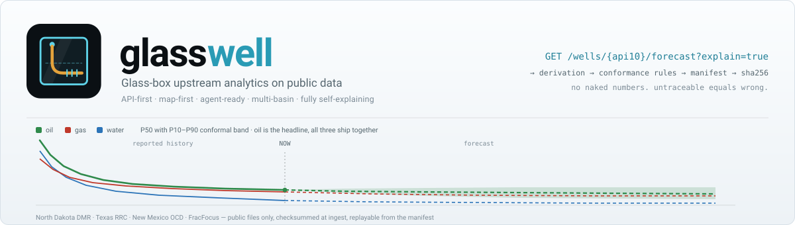
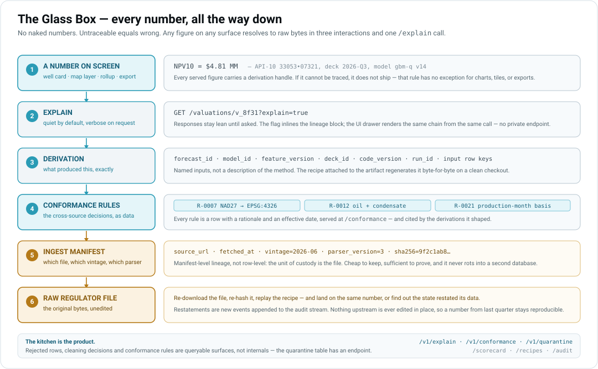
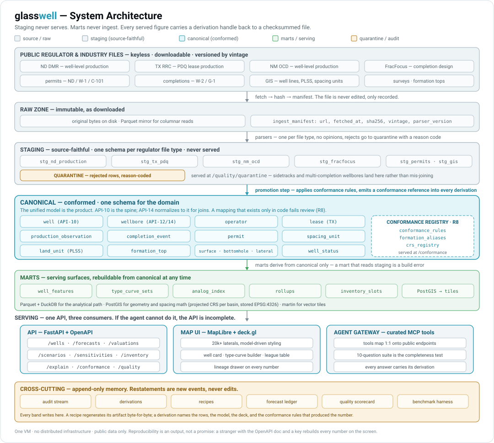
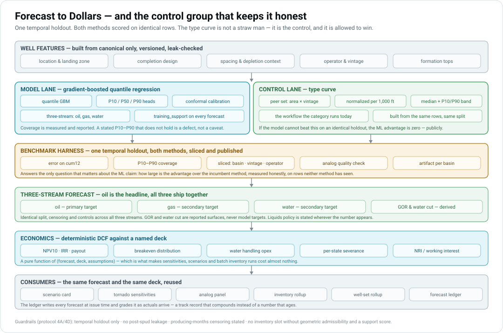
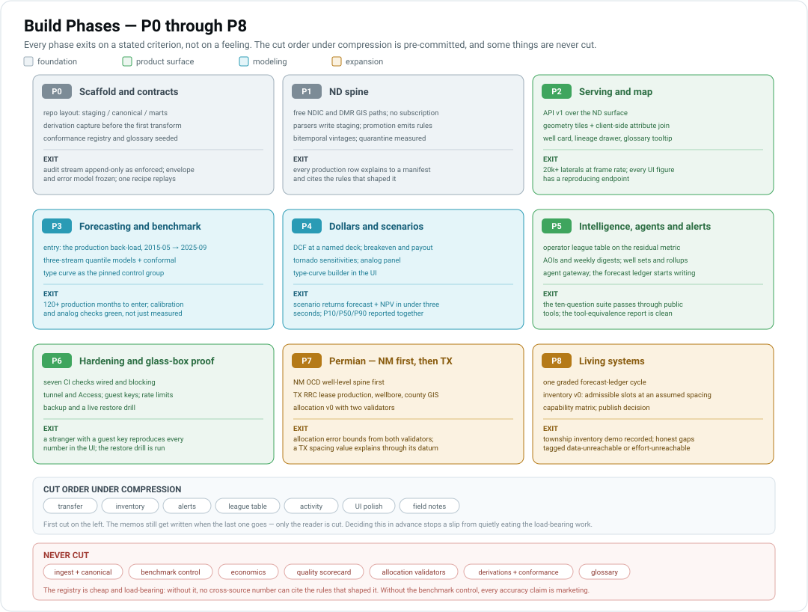

<p align="center">
  <picture>
    <source media="(prefers-color-scheme: dark)" srcset="assets/banner-dark.svg">
    <source media="(prefers-color-scheme: light)" srcset="assets/banner-light.svg">
    
  </picture>
</p>

<p align="center"><strong>Glass-box upstream analytics on public data</strong></p>

<p align="center">
  
  
  
  
  
  
</p>

glasswell rebuilds the public-data tier of the upstream analytics stack — well-level
production, three-stream forecasts, economics, scenarios, inventory, and a map —
across structurally different reporting regimes, and exposes every decision
inside it. Ingest, cleaning, cross-source conformance, modelling, and valuation are
queryable surfaces rather than internals. Every figure it serves carries a
derivation handle back to a checksummed regulator file, or it does not ship.

<p align="center">
  Well-level production &#183; three-stream forecasts &#183; DCF economics &#183;
  scenarios &amp; sensitivities &#183; analogs &#183; inventory &#183; vector-tile map &#183;
  complete self-describing API
</p>

> Copyright (C) 2026 Ryan MacDonald &lt;ryan@rfxn.com&gt; &#183; All rights reserved

> [!IMPORTANT]
> **Early build, public source, proprietary, and not a product.** The repository holds the
> blueprint, the collateral built from it, and a five-state slice — North Dakota
> end to end, Texas and Montana on the map, New Mexico's headers, surface geometry and
> production resident, and Colorado registered through the registry rather than built.
> glasswell is a personal single-operator build on public regulator data. It is not
> commercial, not multi-tenant, not investment advice, and not a source of verified reserves
> or ownership. The deployed instance is reachable but credential-gated; repository
> visibility grants no license. Regulator-data redistribution and the capability matrix
> remain separate review decisions under [`blueprint.md`](blueprint.md) §8.2.

---

## Contents

- [What runs today](#what-runs-today)
- [Why it exists](#why-it-exists)
- [The glass box](#the-glass-box)
- [Architecture](#architecture)
- [The canonical model is the product](#the-canonical-model-is-the-product)
- [Forecast to dollars](#forecast-to-dollars)
- [Data sources](#data-sources)
- [API surface](#api-surface)
- [Build phases](#build-phases)
- [Success criteria](#success-criteria)
- [What this is not](#what-this-is-not)
- [Development](#development)
- [Project docs](#project-docs)
- [License](#license)
- [Support](#support)

---

## What runs today

Four states on one VM, at four honest depths.

**North Dakota — end to end.** NDIC monthly production and DMR GIS geometry in the raw
zone under content-addressed manifests, conformed into a canonical model with a rule
registry and a quarantine ledger, served through FastAPI, drawn as vector tiles on a
MapLibre map, and traceable — a production number on the chart resolves through one
`/v1/explain` call to a SHA-256 and the `dmr.nd.gov` URL it came from.

**Montana — production promoted, on the map.** It arrived as conformance rows before it
arrived as data, because MBOGC publishes two grains that each state their own liquids
basis and null semantics; both reach canonical, and the lease grain carries no API-10, so
every state predicate over it is written on `source_id`. It serves no basin tag
deliberately — at 4.6% Bakken, tagging the state would corrupt the type-curve peer ladder.

**Texas — geometry only.** RRC county GIS layers and the wellbore export give the Permian
districts their wells, bore geometry and operators, transformed out of NAD27 through a
manifested NADCON grid. Production is **not** there: the Railroad Commission reports by
lease, so a Texas well card says production is pending allocation and names the rule
rather than drawing an empty chart.

**New Mexico — resident.** The OCD header ingest, coordinate policy and tile mart are live,
and the promotion has run: a header row and a surface point per well are in
`canonical.wells` and `canonical.well_spatial`, with OCD production beside them at the
well-completion-pool grain. Since v0.74 an NM well's status class is resolved at read time
from a registered OCD codebook rather than written at promotion, so NM draws in its classes;
the four codes the regulator publishes and glasswell has no class for are served as their
own class rather than guessed at or hidden.

Forecasts, economics, scenarios, inventory, Texas allocation and the agent gateway are
**not** in it. [SMOKE.md](SMOKE.md) is the deployment walkthrough; [STATUS.md](STATUS.md)
is the current ledger and owns every count.

## Why it exists

Upstream capital decisions — drill, buy, lend, trade — all reduce to one question:
given the rock, the completion design, and depletion by the neighbours, what will
this well produce and what is that worth. The incumbent workflow is a manual type
curve in a spreadsheet. The vendor answer is curated data plus machine-learning
forecasts plus economics plus dashboards, delivered from a black box.

glasswell rebuilds that loop on public files, alone, and opens the box. It exists to
answer questions that are hard to answer from either side of a sales call:

1. Where does public data actually fail, and what exactly does proprietary data buy?
2. How large is the machine-learning advantage over a type curve when it is measured honestly?
3. What does the forecast-to-dollars path look like, and who consumes which output?
4. Where does an agent layer fit, and what does it demand from the API?
5. What is the measured error rate of public data, and what does allocation cost in accuracy?
6. Does a model trained in one basin transfer to another, and what breaks when it moves?
7. What does audit-grade lineage cost to build, and is it viable as a product feature?
8. How much of this category's product surface is schema and conformance work rather than modelling?

Two mandates, one system. It has to work — a real loop over real files, with the
numbers checked. And it has to teach — if a visitor cannot trace a figure on screen
back to a checksummed regulator file, the build has failed even when the number is
right.

## The glass box

A garage build cannot compete on brand or data volume, so its only trust mechanism
is total transparency. That turns out to be the interesting part: audit-grade
provenance is a feature this category should ship and does not.

<p align="center"></p>

Six rules, and they are load-bearing rather than aspirational:

1. **No naked numbers.** Every served figure carries a derivation handle. Untraceable equals wrong.
2. **The kitchen is the product.** Cleaning decisions, rejected rows, and conformance rules are queryable. The quarantine table has an endpoint.
3. **Reproducibility is an output.** Every artifact ships with the recipe that regenerates it byte-for-byte.
4. **Quiet by default, verbose on request.** Responses stay lean; `?explain=true` inlines the lineage; the UI drawer reads the same call.
5. **Append-only memory.** One audit stream. Restatements are new events, never edits, so last quarter's number stays reproducible.
6. **The build emits learning.** Findings memos live alongside the data they came from, with live links.

## Architecture

One VM. Public files in, Parquet and DuckDB for the analytical path, PostGIS for
geometry, vector tiles to a browser, and a curated tool surface for agents. No
distributed infrastructure, and nothing that cannot be rebuilt from the raw zone.

<p align="center"></p>

The layering is strict and it is the whole design:

| Layer | Contract |
|-------|----------|
| **Raw** | The file exactly as downloaded, hashed, with a manifest recording url, fetch time, vintage, and parser version. Never edited. |
| **Staging** | Source-faithful. One schema per regulator file type, no opinions, rejects quarantined with a reason code. **Never serves.** |
| **Canonical** | Conformed. One schema for the domain, with every cross-source mapping decision recorded as data. |
| **Marts** | Serving surfaces — features, tiles, rollups — derived from canonical only. **Never ingests.** |

Cross-cutting and always on: the append-only audit stream, derivations, recipes,
the forecast ledger, the quality scorecard, and the benchmark harness. Every layer
writes to them.

See [ARCHITECTURE.md](ARCHITECTURE.md) for the component inventory and the rules
that govern each boundary.

## The canonical model is the product

The loudest technical claim in this category is ETL. OSDU exists because no two
regulator schemas agree. So the unified data model is not plumbing under the
product — it *is* the product, and rebuilding it in the open is the point.

Which makes **rule R8** the sharpest thing in the repository: *every cross-source
mapping decision is a row, not a line of code.* A mapping that exists only in code
fails review.

`conformance_rules` is served at `/v1/conformance` — R8 states the surface as
`/conformance`; the version prefix is this implementation's — referenced by the
derivations of every number it shaped, and seeded from real gotchas rather than
invented ones:

| Decision | Rule |
|----------|------|
| Legacy Texas RRC coordinates are frequently NAD27; modern layers are NAD83/WGS84. Untransformed, that is up to ~100 m of silent position error — enough to corrupt spacing math. | Datum detected per file vintage, transformed to EPSG:4326 for storage, transform recorded in the derivation. Compute CRS per basin lives in `crs_registry`; storage is always 4326 and distance math is always projected. |
| Condensate versus oil classification differs by state. | Regulator classification is preserved in staging; canonical carries the stream plus a `liquids_policy` tag. Oil-plus-condensate is the default modelling liquid, stated everywhere it appears. |
| Gas volumes are reported at the regulator's stated conditions. | Conformed to mcf with the conditions recorded, not silently normalised. |
| Production month versus report month differs by source. | Resolved per source and recorded. |
| Formation names are inconsistent across operators and eras. | Conformed through `formation_aliases` (reported name, canonical formation, benchmark group, confidence, and knowledge vintage); tops and landing zones pass through it. |
| Well status vocabularies differ everywhere. | Mapped to a small canonical set — as rows, not code. |

Identity policy: API-10 is the spine, API-14 normalises to it for joins. One
producing wellbore per API-10 is assumed; sidetracks and multi-completion wellbores
are *detected and quarantined with a reason* rather than mis-joined, and the
quarantined share is published in the scorecard.

## Forecast to dollars

<p align="center"></p>

**Forecasts are not live.** What exists is the artifact boundary underneath them: a feature
set, a model-ready dataset and a pinned type-curve control, each content-addressed, each
replaying byte-identically across independent builds, over eight fixed rolling splits that
the model and the control must share. FracFocus `JobEndDate` anchors completion timing with
no spud or first-production fallback. One gate is red — the control's unavailability share
in the immutable historical artifact — and it is published red rather than widened.

Current artifact versions, coverage percentages and the accepted publication id live in
[STATUS.md](STATUS.md); the contracts and evidence are in
[`docs/p3-matrix-integrity.md`](docs/p3-matrix-integrity.md) (the strict-history versus
reconstructed-source clocks),
[`docs/p3-model-ready-dataset.md`](docs/p3-model-ready-dataset.md) (labels, curves,
censoring) and [`docs/p3-type-curve-control.md`](docs/p3-type-curve-control.md) (the control
contract and its gate).

The planned modeling path uses a gradient-boosted quantile model with conformal
calibration to produce P10/P50/P90 on three streams — oil as the headline, gas and
water as secondary targets under identical split, censoring, and control rules. GOR
and water cut are derived surfaces, never targets.

The type curve is not a straw man in this design; it is the control group, built
from the same rows on the same split, and it is allowed to win. The benchmark
harness scores both on one temporal holdout and publishes the result sliced by
basin, vintage, and operator. A stated P10–P90 band that does not hold its coverage
is a defect, not a caveat.

Economics is a pure function of `(forecast, deck, assumptions)` — which is exactly
why tornado sensitivities, scenario runs, and batch inventory valuation cost almost
nothing once the forecast exists. The forecast ledger writes every forecast at
issue time and grades it as actuals arrive, so the track record compounds instead
of the number ageing.

## Data sources

Public, keyless, and downloadable. Everything is captured to the raw zone, hashed,
and recorded in a manifest before anything reads it.

| Basin | Sources |
|-------|---------|
| **North Dakota** (Bakken / Three Forks) | DMR well-level monthly production and public GIS wells, laterals, surveys and spacing units; FracFocus hydraulic-fracturing completion anchors |
| **Texas** (Midland, TX Delaware) | RRC county GIS wells and well arcs, wellbore query export *(landed)*; PDQ lease production, W-2 / G-1 completions, W-1 permits, wellbore master *(designed, not ingested)* |
| **New Mexico** (Delaware) | OCD well headers and surface geometry *(landed)*; OCD production at the well-completion-pool grain — a third spine, and the allocation validator *(landed)*. Status resolves at read time from the OCD codebook, `cr_nm_wellhistory_status_vocab_2` |
| **Montana** (Elm Coulee and the rest of the state) | MBOGC monthly production at both the well and lease grains, GIS surface points and well paths. No basin tag: Bakken is 4.6% of the state (`cr_mt_basin_scope_1`) |
| **Colorado** (DJ / Piceance / Powder River) | ECMC GIS well headers and the rolling monthly production file *(landed)*. Status resolves at read time from the live ECMC reference list, `cr_co_wells_status_vocab_1`; production is per completion with a well row beside it; nearly half the served points are permit locations rather than surveys, and `cr_co_wells_location_qualifier_1` is what says so on the card |
| **Cross-cutting** | FracFocus disclosure headers, PLSS and spacing units, operator registries |

Texas reports at the lease level while North Dakota and New Mexico report at the
well level. That asymmetry is not an inconvenience to be smoothed over — it is the
allocation problem, it is the highest-learning build in the project, and its error
bounds get measured against two independent validators and published.

## API surface

API-first: 58 operations across 53 paths in the frozen snapshot, 57 of them under `/v1`.
The read surface covers health and operational status, wells and their facets, production,
per-well cumulative volumes with the month classes behind them, vintage cohorts, completion
context and promoted completion design, physical neighbours, formations, lineage,
manifests, conformance, quarantine, glossary and tiles:

```
GET  /v1                                 GET  /v1/health
GET  /v1/status                          GET  /v1/wells
GET  /v1/wells/facets                    GET  /v1/wells/status-summary
GET  /v1/wells/{api10}                   GET  /v1/wells/{api10}/production
GET  /v1/wells/{api10}/production/pools  GET  /v1/wells/{api10}/completions
GET  /v1/wells/{api10}/cumulatives       GET  /v1/wells/vintage-cohorts
GET  /v1/wells/{api10}/neighbors         GET  /v1/wells/{api10}/type-curve
GET  /v1/type-curves                     GET  /v1/formations
GET  /v1/modeling/publications           GET  /v1/modeling/publications/{id}
GET  /v1/explain?h={handle}              GET  /v1/derivations[/{id}]
GET  /v1/manifests[/{id}]                GET  /v1/vintages[/{id}]
GET  /v1/conformance[/{rule_id}]         GET  /v1/quarantine[/{id}]
GET  /v1/quarantine/summary              GET  /v1/glossary[/{term}]
GET  /v1/errors/{code}                   GET  /v1/tiles/{layer}/{z}/{x}/{y}.pbf
```

Session, user and key administration add the write operations
(`/v1/session`, `/v1/users`, `/v1/keys` and their sub-paths). The snapshot in
`tests/contract/openapi_snapshot.json` is the complete list; `/healthz`,
`/v1/glossary/index` and `/v1/manifests/{id}/bytes` are omitted above only for width.

The application has three URL-backed surfaces: **Map**, **Explore** and **Status**. Well
cards show current physical neighbours for lateral-bearing wells, with strict
earlier-completion cutoffs, exact distance and coverage lineage, and an explicit warning
that proximity does not make a model analog. Status joins live API and PostgreSQL signals
to a sanitised host snapshot, inventory counts with declared grains, and independently
committed poll outcomes per source — one source key's success can never mask another's
failure, and a stale snapshot never keeps a green check.

Two invariants hold across the surface. Every selector-bearing figure is validated against
a fail-closed persisted output profile, so changed output trips the determinism gate rather
than shipping. And conformance rules, lookup rows and CRS routing carry an immutable
publication clock independent of their valid interval — `/v1/conformance` exposes both, and
a pre-glasswell source vintage uses the first published policy as its baseline rather than
a backdated correction.

Forecast, valuation, sensitivity, scenario, agent and undrilled-location inventory
operations remain designed scope, not live routes. The UI consumes the same public API
documented by the checked-in OpenAPI snapshot; there is no private endpoint behind it.

## Build phases

<p align="center"></p>

Each phase exits on a stated criterion. The cut order under compression is decided
in advance — that is what stops a schedule slip from quietly eating the load-bearing
work. See [ROADMAP.md](ROADMAP.md) for the full phase contents.

## Success criteria

The build is measured against outcomes, not a feature checklist:

| | Criterion |
|---|---|
| S1 | A stranger with the OpenAPI doc and a key reproduces every number in the UI |
| S2 | 20k+ laterals with model-driven styling at interactive frame rates on one VM |
| S3 | A scenario returns forecast plus NPV in under three seconds |
| S4 | Benchmark artifact per basin, sliced, type curve versus model on an identical temporal holdout |
| S5 | The agent passes the ten-question suite through public tools, every figure traceable |
| S6 | Allocation v0 with measured error bounds from both validators |
| S7 | Forecast ledger live with one graded cycle complete |
| S8 | Quality scorecard published and reproducible from the API |
| S9 | Any UI number reaches a raw manifest in three or fewer interactions and one `/explain` call |
| S10 | Capability matrix with evidence links and honest gaps, each tagged data-unreachable or effort-unreachable |
| S11 | Conformance registry served: every cross-source number can cite the rules that shaped it |
| S12 | Inventory demo: remaining locations for a chosen township, with forecasts and NPV at a deck |

## What this is not

Stated plainly, because the failure mode of a system like this is confident nonsense:

- **Not mineral ownership.** No ownership graph, no title, no chain of interest.
- **Not daily production.** Monthly regulator reporting only.
- **Not reserves.** Inventory slot counts are geometrically admissible locations at a stated spacing assumption with a stated support distribution. They are not reserves and never render without both statements.
- **Not a commercial product**, not multi-tenant, and not a hosted service.
- **Not an OSDU implementation.** A mapping memo is written as a literacy exercise; the lean bespoke model is the build.
- **Not investment advice.** Every number is derived from public filings that states restate.

## Development

Python 3.12, Polars, DuckDB, FastAPI, PostGIS. Source lives under `src/`, tests under
`tests/`, and database migrations are plain SQL applied by `glasswell.db.migrate`.

```
src/glasswell/lineage/   the lineage and reproducibility spine every layer imports
src/glasswell/db/        migration runner and NNN_name.sql migrations
tests/unit/              pure functions; no database, no docker
tests/integration/       ephemeral PostGIS container, one database per test
tests/contract/          FastAPI/OpenAPI surface and frozen snapshot checks
```

```bash
make install           # create .venv and install glasswell with dev dependencies
make test              # the tests this diff can reach, four workers, selection printed
make test-full         # the whole suite, four workers — before pushing a release train
make test-anvil        # whole suite on the lab CI host — the default for a full run
make test-local        # whole suite on this machine's docker daemon
make test-unit         # pure-function tier, runs without docker
make test-integration  # PostGIS tier
make check-workstation # flag glasswell persistent state on a workstation
make lint              # ruff
```

Installed console scripts, for the pipelines an operator runs by hand rather than on a timer:

```
glasswell-migrate            apply pending migrations
glasswell-owner-bootstrap    create the first owner account, password on stdin only
glasswell-owner-reset        break-glass: set a password and clear a lockout
glasswell-features           build the feature matrix
glasswell-model-dataset      build the model-ready dataset
glasswell-typecurve-control  refresh the pinned type-curve control
glasswell-p3-context-publish publish the P3 context baseline
glasswell-neighbors          rebuild the physical-neighbour mart
glasswell-fracfocus          ingest FracFocus completion anchors
glasswell-mt-bogc            ingest MBOGC production, both grains
glasswell-mt-gis             ingest the MBOGC GIS surface points and well paths
glasswell-nm-wells           ingest the OCD well headers and surface geometry
glasswell-nm-tiles           build the New Mexico tile mart
glasswell-co-wells           promote the ECMC well headers and surface geometry
glasswell-co-production      promote the ECMC rolling production file
glasswell-basin-boundaries   load basin boundaries; glasswell-eia-boundaries fetches them
```

Each multi-step load has a runbook that states its commands, the user that runs each,
expected counts and the undo: [Montana](docs/runbook-mt-load.md),
[basins](docs/runbook-basin-load.md), [Colorado](docs/runbook-co-tier2.md), and New Mexico in
[two](docs/runbook-nm-tier2.md) [tiers](docs/runbook-nm-promotion.md). Colorado's six jobs are
registered and observed rather than launched, so its runbook is the first load, not a way of
watching one happen.

The integration tier starts one `postgis/postgis:16-3.4` container per session and clones a
migrated template database per test. It honours an inherited `DOCKER_HOST`, then the local
socket, then `tcp://127.0.0.1:2376` with TLS; without a reachable daemon it skips with a
reason and the unit tier still runs.

A remote daemon changes one thing: a container's bridge IP routes only from the daemon's own
host, so the harness publishes the database port and addresses it by the daemon's hostname
while containers a test starts keep the bridge address. `daemon_address` in
`tests/conftest.py` is the single place that decision is made, and
`tests/integration/test_harness_hygiene.py` asserts the branch actually taken. The DSN
carries keepalives and `tcp_user_timeout` so a collapsed LAN connection fails a test rather
than hanging the session.

Full suites run on `anvil`, the lab CI host; a workstation runs single-file iteration.
Nothing of glasswell's — service, timer or dataset — is installed on a workstation, and
`make check-workstation` is what says so out loud.

Migrations are append-only: add `NNN_name.sql`, never edit an applied one — the runner
records each file's checksum and refuses a changed migration.

## Project docs

| Document | Contents |
|----------|----------|
| [STATUS.md](STATUS.md) | Current release, phase ledger, verified gaps, and validation state |
| [SMOKE.md](SMOKE.md) | Dated walkthrough of the deployed slice and its observed gaps |
| [blueprint.md](blueprint.md) | The product and engineering contract. Anything not in scope there is out until it changes. |
| [ARCHITECTURE.md](ARCHITECTURE.md) | Layers, components, boundaries, and the rules R1–R8 |
| [ROADMAP.md](ROADMAP.md) | Build phases P0–P8 with exit criteria, current status and cut order |
| [docs/p3-context-repair.md](docs/p3-context-repair.md) | Same-manifest repair policy, source-absent lateral disposition, exact split/hash proof, and accepted live publication |
| [docs/p3-type-curve-control.md](docs/p3-type-curve-control.md) | Pinned `tcv1.0` control contract, D1 replay evidence, and the explicit red coverage gate |
| [docs/p3-matrix-integrity.md](docs/p3-matrix-integrity.md) | Feature-matrix availability semantics, and the strict-history versus reconstructed-source clocks |
| [docs/p3-model-ready-dataset.md](docs/p3-model-ready-dataset.md) | `mdv1.4` labels, curves, censoring coverage, and the eight content-addressed rolling splits |
| [docs/runbook-basin-load.md](docs/runbook-basin-load.md) | Loading the EIA basin and play boundaries: the two commands, which user runs each, expected counts, and the undo |
| [docs/runbook-mt-load.md](docs/runbook-mt-load.md) | Loading Montana on the deployed host: commands, expected counts, success versus partial, and how to undo |
| [docs/runbook-nm-tier2.md](docs/runbook-nm-tier2.md) | Tier 2 — opening the New Mexico gate: well headers, surface geometry and the tile mart, with the preconditions, gates and the one decision that cannot be taken afterwards |
| [docs/runbook-nm-promotion.md](docs/runbook-nm-promotion.md) | Tier 1 — the New Mexico production-history load: nine manifests, the staged spine and its ~24.8M appended rows |
| [docs/runbook-co-tier2.md](docs/runbook-co-tier2.md) | Colorado's first data load: three GIS archives, the rolling production file, both promotions and the mart, with a merge-blocking gate over all five states |
| [docs/runbook-scheduler.md](docs/runbook-scheduler.md) | The cadence-driven scheduler: reading the plan, running one job by hand, every refusal code and its severity, registering a job, and what observing means |
| [docs/ci-gate.md](docs/ci-gate.md) | The merge gate: what each job refuses, the tree-identity skip, the four shards and what keeps them honest, the nightly control, and `make test`'s diff selection |
| [BRAND.md](BRAND.md) | Visual system, palette, and asset regeneration |
| [CONTRIBUTING.md](CONTRIBUTING.md) | How changes are made, and what review rejects |
| [SECURITY.md](SECURITY.md) | Vulnerability reporting |
| [llms.txt](llms.txt) | Machine-readable orientation for agents |

## License

Proprietary. Copyright (C) 2026 Ryan MacDonald, all rights reserved — see
[LICENSE](LICENSE). Access to this repository does not convey any right to its
contents.

Public regulator data carries its own terms, set by the agencies that publish it.
Attribute the agency that publishes a file, not glasswell.

## Support

Ryan MacDonald &lt;ryan@rfxn.com&gt;

Change control: edits to the protocols, the design philosophy, the canonical model
thesis, or rules R1–R8 require a written rationale in the commit. Everything else
is fair game.
